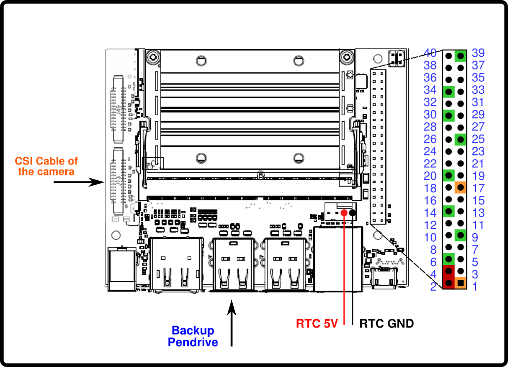

# Camera Capturing Platform

In this document the hardware and the software of the camera that is used to capture with the camera is described. 

## Hardware

### Jetson Nano Connections

The following scheme shows where to connect the external cables to the board that controls the camera capturing process. For the GPIO connections, refer to the [following list](#gpio-connection-list).



#### GPIO connection list

* **Pins 1 - 6**: connect them to the six pin header of the camera.
* **Pin 12**: *Camera connection pin*. Connect it to the GPIO 5 in the Arduino.
* **Pin 16**: *Memory State LSB*. Connect it to the GPIO 6 in the Arduino.
* **Pin 18**: *Memory State MSB*. Connect it to the GPIO 7 in the Arduino.
* **Pin 27**: Connect it to the **SDA** pin of the **RTC**.
* **Pin 28**: Connect it to the **SCL** pin of the **RTC**.

## Software

### Installation

#### Initialize the process when the board is plugged in.

To execute the capturing code when the board is turn on, a custom service must be created. The service used is stored in the **.service** folder by the name of *camera-process.service* . The first step is to modify the document with the name of the current user and the current path of the *.sevice/execute_script.sh* file. Once the service points to the correct path, give execution permission to the *execute_script.sh* file. After that, execute the following commands to enable the service:

```bash
sudo cp .services/camera-process.service /etc/systemd/system
sudo systemctl start camera-process.service
sudo systemctl enable camera-process.service
```

The script will be executed once the board boots again. To stop the process after the start, run:

```bash
sudo systemctl stop camera-process.service
```

To check the status of the script, run the following command:

```bash
sudo systemctl status camera-process.service
```

To prevent the script to execute at the startup, run:

```bash
sudo systemctl disable camera-process.service
```


