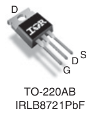

---

## [Temperature sensors](./temp_sensor)

Some Arduino code to identify and request the OneWire [DS18B20](https://www.analog.com/media/en/technical-documentation/data-sheets/ds18b20.pdf) temperature sensor.

Use libraries:

- https://playground.arduino.cc/Learning/OneWire/
- https://www.milesburton.com/w/index.php/Dallas_Temperature_Control_Library

---

### [Detect sensor ID](./temperature/detect_ds1820_tempsens_id/)

Get the sensor ID, better to have just one sensor to know the ID, because it will print all the sensors ID found

### [Get sensor temperature](./temperature/get_temp_ds18b20_wid/)

Having the IDs of the sensor, it will request their temperatures

### [Temperature control](./temperature/tempsens_heatpad)

Using the MOSFET [IRLB8721](https://www.infineon.com/cms/en/product/power/mosfet/n-channel/irlb8721/) to control the headmats.

Heatpads. https://es.rs-online.com/web/p/alfombrillas-calefactoras/0245512

