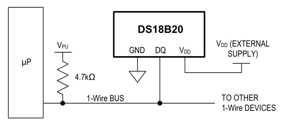

# Flight manager:

[Larger image of electronics schematic](../imgs/cubesat_schematic.jpg)

The main stack of arduino boards is the following from bottom to top:

- MKR connector: https://docs.arduino.cc/hardware/mkr-connector-carrier
- MKR WAN 1310: https://docs.arduino.cc/hardware/mkr-wan-1310
- MKR MEM SHIELD: https://docs.arduino.cc/hardware/mkr-mem-shield
- MKR IMU SHIELD: https://docs.arduino.cc/hardware/mkr-imu-shield

Then there are other boards connected by I2C

- MKR GPS Shield: connect to the ESLOV connector https://docs.arduino.cc/hardware/mkr-gps-shield
- Grove - Temp&Humi&Barometer Sensor (BME280) https://www.seeedstudio.com/Grove-BME280-Environmental-Sensor-Temperature-Humidity-Barometer.html
- Grove - DS1307 RTC (Real Time Clock) for Arduino https://www.seeedstudio.com/Grove-RTC-DS1307.html

The temperature sensors are connected directly by Onewire protocol:

- DS18B2 temperature sensors [see below](#Temperature-sensors)

Finally, the heatpads are connected through a board that includes the MOSFET to control them (we have soldered the board) [see below](#Temperature-control)

### Requirements

This code requires the following libraries:
- Wire.h
- MS5x.h
- MKRIMU.h
- LoRa.h

Using the Arduino Library manager, search and install the following packages:

* BNO055 - Adafruit; and it dependencies.
* BM280 - Adafruit; and it dependencies.
* Groove RTC DS1307 - Speeed Studio
* OneWire https://playground.arduino.cc/Learning/OneWire
* Dallas Temperature: https://www.milesburton.com/w/index.php/Dallas_Temperature_Control_Library

### Setup

The Flight Manager should be connected to an IMU and a barometric pressure sensor. The LoRa module should also be properly connected.

### Usage

Upon startup, the Flight Manager will attempt to connect to the barometric pressure sensor. Once connected, it will continuously poll the sensor for data and transmit it via LoRa. Flight data is formatted into a byte array that includes start and stop bytes, as well as the following data:
- Roll
- Pitch
- Heading
- Temperature
- Pressure
- Sea level pressure
- Altitude
- Corrected altitude

In addition to transmitting the data, the Flight Manager also prints it to the serial monitor.

-------------------

## [Temperature sensors](./temperature)

Arduino code to identify and request temperature from the OneWire
 [DS18B20](https://www.analog.com/media/en/technical-documentation/data-sheets/ds18b20.pdf) temperature sensor, and to control the heatmats

Use libraries:

- https://playground.arduino.cc/Learning/OneWire
- https://www.milesburton.com/w/index.php/Dallas_Temperature_Control_Library

The cubesat has five DS18B20 temperature sensors, whose internal codes referred to the cubesat laid down and from the camera side, are:

Sensors inside the battery box
- Right (Derecha):  28 53 6E 95 F0 01 3C EE (waterproof sensor)
- Left (Izquierda): 28 37 50 95 F0 01 3C D7 (waterproof sensor)
- Down (Bajo):      28 7A EF 95 F0 01 3C C8 (waterproof sensor)
- Inside box:       28 55 B3 95 F0 01 3C EE (waterproof sensor)
- Inside cubesat:   28,FF 10 4B 20 18 01 10 (PCB sensor with resistor)

---

## Reference

Since there are 5 temperature sensors, 3 of them at the sides of the batteries. To know which sensor is each of them, the reference is taken from the following picture, considering I the left (Izquierda), and R the right (Derecha)

### [Detect sensor ID](./temperature/detect_ds1820_tempsens_id/)

Get the sensor ID, better to have just one sensor to know the ID, because it will print all the sensors ID found.

As explained in the datasheet, there are two options for the sensor connection, we have used the one with external supply, using as VDD the 5V of the Arduino. 
A 4.7 Ohm resistor is needed, but the board sensor already has one. In the other cases, you will need to connect it.

Various sensor can be connected in multidrop, with multiple slaves.

### [Get sensor temperature](./temperature/get_temp_ds18b20_wid/)

Having the IDs of the sensor, it will request their temperatures.

Since one of the sensors is in a board with a resistor, an additional resistor is not needed.

### [Temperature control](./temperature/tempsens_heatpad)

It has been tested with two sensors and two heatmats. The two heatmats are connected in parallel.
Since one of the sensors is in a board with a resistor, an additional resistor is not needed.

Using the MOSFET [IRLB8721](https://www.infineon.com/cms/en/product/power/mosfet/n-channel/irlb8721/) to control the heatmats.

The connections of the MOSFET are the following:
 - Gate (G) goes directly to a PWM output pin of the Arduino.
 - Source (S) goes to the GND
 - Drain (D) goes to one of the wires of the heatpad, the other wire of the heatpad goes to the external battery. We have connected two heatpads in parallel, since the MOSFET has an absolute maximum continous drain current of 62A at VGS=10V and T=25C

**This code is for a battery of 12V or less**. We are using a 7.2V or 7.4V battery. In case you use a 14V battery you have to use PWM (analogueWrite) for the Full-ON cases, and have a maximum value of 212 (and test it). I think it might be a good idea to use the 14V battery with the PWM.

The battery GND is connected with the Arduino GND.

Heatpads: https://es.rs-online.com/web/p/alfombrillas-calefactoras/0245512

