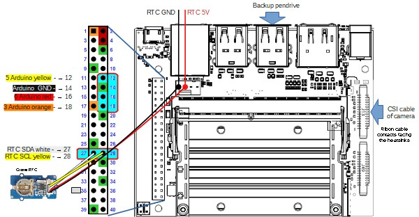

# Bentayga Cubesat

## Description

This project describes the Bentayga 3U cubesat, developed by [IUMA](https://www.iuma.ulpgc.es/) at the [University of Las Palmas de Gran Canaria](https://www.ulpgc.es/).

The project is composed by three main parts:

- Structure made of 10x10 profiles, 3D printed parts and CNC milled FR4 fiberglass
- [Multispectral image acquisition](#multispectral-image-acquisition), composed by a Jetson Nano, 4 cameras with filters
- [Control and Flight manager](#flight-manager), composed by an Arduino MKR WAN 1310, with sensors such as GPS, temperature, humidity, barometer, RTC, IMU, and also controls the temperature of the batteries by activating heat pads.

---

## Bill Of Materials

[BOM](./bom_bentayga_cubesat.ods)

---

## [Assembly instructions](./assembly)

Assembly instructions are in [assembly directory](./assembly)

---

## [Structure](./cad)

CAD files are in [Structure](./cad) directory.

## [Multispectral image acquisition](./CameraBoard)

[Larger image of Jetson Nano connections](./imgs/jetson_schematic.jpg)

More information and source code is in [Camera board](./CameraBoard)

---

## [Flight manager](./Firmware)

The Flight Manager is responsible for gathering flight data from the IMU, sensors and transmitting it via LoRa to a ground station. It is also responsible of keeping batteries warm.

[Larger image of electronics schematic](./imgs/cubesat_schematic.jpg)

More information and source code is in [Firmware](./Firmware)

---

## Contributing

If you wish to contribute to this code, please create a new branch from the develop branch and submit a pull request. 

---

## License

This code is licensed under the MIT License.

---

## CAD Images

