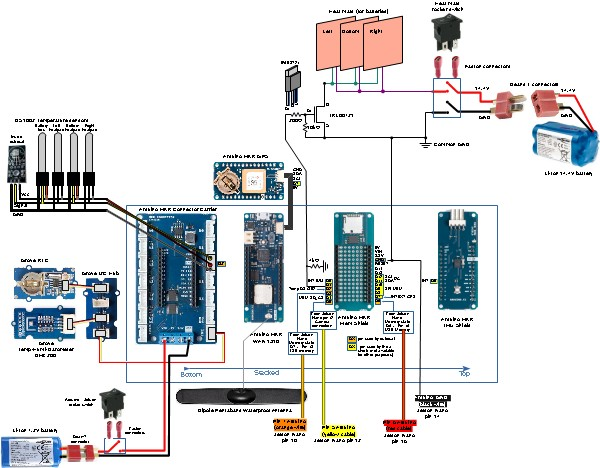

# Bentayga Cubesat

## Description

This project describes the Bentayga 3U cubesat, developed by [IUMA](https://www.iuma.ulpgc.es/) at the [University of Las Palmas de Gran Canaria](https://www.ulpgc.es/).

The project is composed by three main parts:

- Structure made of 10x10 profiles, 3D printed parts and milled FR4 fiberglass
- Multispectral image acquisition, composed by a Jetson Nano, 4 cameras with filters
- Control and Flight manager, composed by an Arduino MKR WAN 1310, with sensors such as GPS, temperature, humidity, barometer, RTC, IMU, and also controls the temperature of the batteries by activating heat pads.

---

## Bill Of Materials

[BOM](./bom_bentayga_cubesat.ods)

---

## Flight manager

The Flight Manager is responsible for gathering flight data from the IMU and barometric pressure sensor and transmitting it via LoRa to a ground station.

[Larger image of electronics schematic](./imgs/cubesat_schematic.jpg)

### Requirements

This code requires the following libraries:
- Wire.h
- MS5x.h
- MKRIMU.h
- LoRa.h

Using the Arduino Library manager, search and install the following packages:

* BNO055 - Adafruit; and it dependencies.
* BM280 - Adafruit; and it dependencies.
* Groove RTC DS1307 - Speeed Studio
* OneWire https://playground.arduino.cc/Learning/OneWire
* Dallas Temperature: https://www.milesburton.com/w/index.php/Dallas_Temperature_Control_Librar

### Setup

The Flight Manager should be connected to an IMU and a barometric pressure sensor. The LoRa module should also be properly connected.

Arduino Shields from bottom-up:
- MKR connector: https://docs.arduino.cc/hardware/mkr-connector-carrier
- MKR WAN 1310: https://docs.arduino.cc/hardware/mkr-wan-1310
- MKR MEM SHIELD: https://docs.arduino.cc/hardware/mkr-mem-shield
- MKR IMU SHIELD: https://docs.arduino.cc/hardware/mkr-imu-shield

### Usage

Upon startup, the Flight Manager will attempt to connect to the barometric pressure sensor. Once connected, it will continuously poll the sensor for data and transmit it via LoRa. Flight data is formatted into a byte array that includes start and stop bytes, as well as the following data:
- Roll
- Pitch
- Heading
- Temperature
- Pressure
- Sea level pressure
- Altitude
- Corrected altitude

In addition to transmitting the data, the Flight Manager also prints it to the serial monitor. 

---

## Contributing

If you wish to contribute to this code, please create a new branch from the develop branch and submit a pull request. 

---

## License

This code is licensed under the MIT License.

---

## CAD Images

