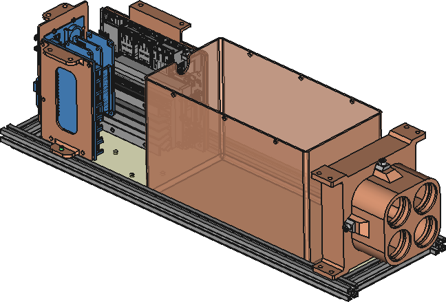

# Assembly instructions

Before assembling the cubesat, have all the electronics connected and make sure that they work. Disconnect the batteries and electronics before the assembly. 

Check the CAD files, and get all the 3D pieces printed and the plates milled.

Get all the components of the [BOM](./../bom_bentayga_cubesat.ods)
Have pliers, Allen keys, screwdrivers. Silicone would be very useful to place the t-slot nuts and prevent them from sliding.

The cubesat has 6 faces, they will be named according to this reference:

## Warning

Take into account that once you close the profiles, you cannot place square bolts and in many times even nuts.

The following picture shows that you cannot add any nut or bolt in the blue profile. In the inner slot of the green profile you can add nuts, but not bolts.

Therefore, before closing a profile think if all the nuts and bolts are placed, and what are you going to attach to the profile.

## Place nuts in 80mm-profiles

There are eight 80mm-profiles at the two squared faces of the cubesat (four at each face). The figure shows one of this faces.

All these profiles have 3 sliding nuts in one side and 2 in the other (you could put 4 but it is not necessary). These nut holes are marked in turquoise circles in the figure. The red circles indicate that these nuts are optional.

Place 2 and 3 sliding nuts in two consecutive sides of these eight profiles.

We recommend that you align these nuts with the holes of the plates and put some silicone to prevent the nuts from sliding. So they are easier to screw with the bolts.
It is not necessary to be super exact, since the silicone leaves room for moving the nuts a little bit. You don't need to wait until the silicone is dry.

The following pictures shows the process.

## Assemble the Down face

Now that you have nuts in the 80mm-profiles, we are going to assemble the Down plate.

The profile at the Cielo side has also a 3D part attached to it (see next figure).

Include two [M3 6-mm square headed bolts](https://www.makerbeam.com/makerbeam-square-headed-bolts-6mm-250p-for-makerbe.html).

Don't put silicone on these bolts

Put in the long 340.5mm profiles five sliding nuts, aligned to the plate holes. It is not necessary to put silicone in these nuts, but you could.

Now put the Down plate over the four profiles attached to it, and screw the M3 4mm Hexagon socket button head screws (ISO7380). Take care that the 80mm profiles have the nuts facing the correct side.

Place the long profiles to be symmetrical, leaving the same distance in each side.

The result should look like this

## Attach the I2C hub to the Down plate

Use three M2 bolts around 6mm long. We have used one steel bolt and nut, and the other two plastic, but you can choose the material.

Picture from the bottom:

## Attach the Jetson Nano

First attach the Jetson Nano to its 3D printed support.

Then take two M3 square headed 6mm bolts and attach the lower part of the Jetson Nano support to it. Then put two M3 self locking nuts, tighten but not so much so you can still slide the Jetson Nano along the profile.

Picture from Top:

## Attach the sensors support

First attach the four boards to the support with M2 plastic bolts and nuts.

-  MKR GPS Shield: connect to the ESLOV connector https://docs.arduino.cc/hardware/mkr-gps-shield
-  Grove - Temp&Humi&Barometer Sensor (BME280) https://www.seeedstudio.com/Grove-BME280-Environmental-Sensor-Temperature-Humidity-Barometer.html
- Two Grove - DS1307 RTC (Real Time Clock) for Arduino https://www.seeedstudio.com/Grove-RTC-DS1307.html

Attach the bottom of the support to the profile. There should be two 6mm square headed bolts in this profile, as indicated in the assembling of the Down face.

Put the self locking nuts as in the Jetson Nano support, but not too tight to be able to slide the support later.

Picture from back:

Picture from Top:

## Attach the Arduino stack

Before attaching the support, **insert four sliding nuts in the profile**. They will be needed for the small camera support, and to contain the battery box.

Also insert two sliding nuts in the opposite profile (Right side) to contain the battery box.

First the Arduino stack should be mounted, also make sure that the components in the MKR MEM Shield have been soldered, and from this shield go the wires to the Jetson Nano and MOSFET for the heat pads (which is soldered in a different board).

The stack of Arduino boards is the following from bottom to top:

- MKR connector: https://docs.arduino.cc/hardware/mkr-connector-carrier
- MKR WAN 1310: https://docs.arduino.cc/hardware/mkr-wan-1310
- MKR MEM SHIELD: https://docs.arduino.cc/hardware/mkr-mem-shield
- MKR IMU SHIELD: https://docs.arduino.cc/hardware/mkr-imu-shield

Attach this stack to the 3D printed support and in the same way as the previous support, attach it to the profile with a 6mm M3 square headed bolt and a self locking nut. Do tighten the nut too much to allow sliding.

Picture from Top (the IMU shield was missing in the picture)

## Attach the multispectral camera

Using four 12-mm square headed bolts and self locking nuts, attach the multispectral camera at the Tierra side as shown in the figure:

## Insert the battery box

Just put it in place to check the dimensions

## Attach the small camera support

Fist attach the original camera support to the 3D printed support, using two M3 6mm counter sunk bolts with self locking nuts.

Then use sliding nuts and tow hex button 4mm bolts to attach it to the profile. Do not tighten it to strong, so it can slide along the profile.

Notice how the original camera support is attached to the 3D printed support.

## Attach the Cielo panel

Now that we have all the elements attached to the bottom, we are going to attach the Cielo panel.

First we have to attach the 80mm profile on Top. Make sure that it is oriented properly, with the 3 sliding nuts pointing to Cielo and 2 sliding nuts pointing to Top. Ideally, there would be silicone to prevent them from sliding.

Picture of the first step to attach the Cielo panel. Notice the silicone on the side of the Cielo nuts to prevent the nuts from sliding.

Include the self locking M3 nuts, but don't tighten them too much yet.

Now position the sensors support on the exact position you want it (by sliding a little bit right or left), and tighten the self locking nuts at the bottom.

Now set the Cielo plate with the two vertical 80mm profiles. Using the M3 4mm-socket button bolts and the sliding nuts. Do not tighten them too much because you will probably need to adjust them.

For the adjustment, you may need to move the top 80mm profile, to center it. Once you have adjusted the bolts by placing in its position, take the plate out and adjust the top self locking nuts of the sensors support.

Once it is all set, put back the plate and tighten all the socket button bolts of the Cielo plate.

Picture with the plate before screwing the vertical socket button bolts

