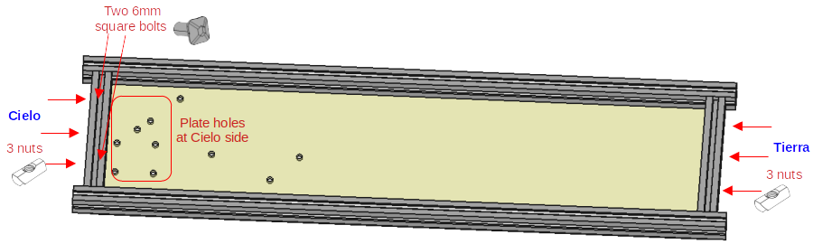

# Assembly instructions

Before assembling the cubesat, have all the electronics connected and working. 
Check the CAD files, and get all the 3D pieces printed and the plates milled.
Get all the components of the [BOM](./../bom_bentayga_cubesat.ods)
Have pliers, Allen keys, screwdrivers. Silicone would be very useful to place the t-slot nuts and prevent them from sliding.

The cubesat has 6 faces, they will be named according to this reference:

## Warning

Take into account that once you close the profiles, you cannot place square bolts and in many times even nuts.

The following picture it shows that you cannot add any nut or bolt in the blue profile. In the green profile you can add nuts, but not bolts in the inner slot.

Therefore, before closing a profile think if all the nuts and bolts are place, and what you need to attach to the profile.

## Place nuts in 80mm-profiles

There are eight 80mm-profiles at the two squared faces of the cubesat. The figure shows one of this faces.

All these profiles have 3 sliding nuts in one side and 2 in the other (you could put 4 but it is not necessary). These nut holes are marked in turquoise circles in the figure. The red circles indicate that these nuts are optional.

Place in two consecutive sides of these eight profiles 2 and 3 sliding nuts. We recommend that you align these nuts with the holes of the plates and put some silicone to avoid the nuts to slide. So they are easier to screw with the bolts.
It is not necessary to be super exact, since the silicone leaves room for moving the slides a little bit. Yoo don't need to wait until de silicone is dry.

The follwing pictures shows the process.

## Assemble the Down face

Now that you have nuts in the 80mm-profiles, we are going to assemble the Down plate.

The profile at the Cielo side has also a 3D part attached to it (see next figure).

Include two [M3 6-mm square headed bolts](https://www.makerbeam.com/makerbeam-square-headed-bolts-6mm-250p-for-makerbe.html).

Don't put silicone on these bolts

Put in the long 340.5mm profiles five sliding nuts, aligned to the plate holes. It is not necessary to put silicone in these nuts, but you could.

Now put the Down plate over the four profiles attached to it, and screw the M3 4mm Hexagon socket button head screws (ISO7380). Take care that the 80mm profiles have the nuts facing the correct side.

Place the long profiles to be symmetrical, leaving the same distance in each side.

The result should be like this

